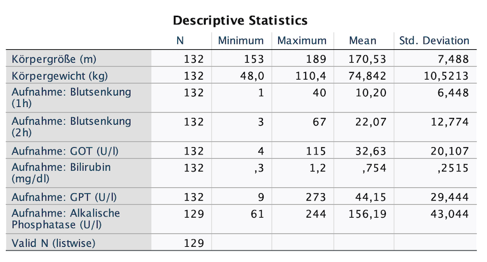

Eine Einführung in die deskriptive Datenanalyse mit SPSS, inklusive Häufigkeitstabellen, statistischer Kennwerte (Mittelwert, SD, Median) und einfacher Visualisierungen über die grafische Benutzeroberfläche.

Datenanalysen beginnen in der Regel mit der deskriptiven Statistik. Ziel ist es, die Daten mithilfe von Tabellen, numerischen Maßzahlen und Grafiken übersichtlich darzustellen und erste Einsichten zu gewinnen.

<figure markdown="span">
  { width="600" }
</figure>

<!-- more -->

## Durchführung der deskriptiven Statistik in SPSS

Um erste Einblicke in deine Daten zu gewinnen, bietet SPSS verschiedene Werkzeuge für die deskriptive Analyse. Hier sind einige wichtige Schritte:

---

### 1. Häufigkeitstabellen n (%) für kategoriale Variablen

Für nominal- oder ordinalskalierte Variablen (z. B. Geschlecht, Diagnosekategorie) eignen sich Häufigkeitstabellen:

**Vorgehen:**
- Menü: `Analysieren` → `Deskriptive Statistiken` → `Häufigkeiten`
- Wähle die gewünschte(n) Variable(n) aus

{ align=center }
/// caption
Abbildung 1: Beispiel einer Häufigkeitstabelle
///

---

### 2. Min., Max. und Mittelwert (SD) für metrische Variablen

Für intervall- oder verhältnisskalierte Variablen (z. B. Alter, Blutdruck) kannst du Kennwerte wie Mittelwert, Median und Standardabweichung berechnen:

**Vorgehen:**
- Menü: `Analysieren` → `Deskriptive Statistiken` → `Deskriptive Statistiken`
- Wähle die gewünschte(n) Variable(n) aus
- Klicke auf `Optionen` → wähle die gewünschten Kennwerte (z. B. Mittelwert, Min, Max, SD)

{ align=center }
/// caption
Abbildung 2: Beispiel einer Tabelle für metrische Variablen
///

---

### 3. Explorative Analyse mit `Explore`

Wenn du mehrere Variablen analysieren und nach Gruppen vergleichen möchtest:

**Vorgehen:**
- Menü: `Analysieren` → `Deskriptive Statistiken` → `Explore`
- Variablen in „Abhängige Liste“ ziehen
- Gruppierungsvariable in „Faktorliste“ einfügen

**Ergebnis:**  
SPSS erstellt Boxplots, Diagramme zur Normalverteilung und gruppierte Kennwerte.

---

### 4. Diagramme zur Visualisierung

Diagramme ergänzen tabellarische Ausgaben und erleichtern das Verständnis. Gängige Visualisierungen sind:

- **Balkendiagramm** – für kategoriale Variablen  
- **Histogramm** – für metrische Variablen  
- **Boxplot** – für Gruppenvergleiche

**Vorgehen:**
- Menü: `Diagramme` → Diagrammtyp wählen → Variablen zuordnen → Diagramm erstellen

{ align=center }
/// caption
Abbildung 3: Beispiel eines Boxplots
///
