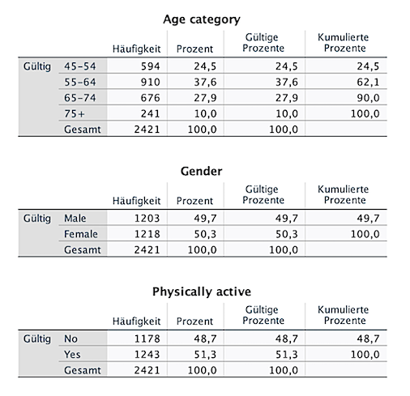

An introduction to descriptive analysis in SPSS, including frequency tables, summary statistics (mean, SD, median), and simple visualizations using the GUI.

Data analysis typically begins with descriptive statistics. The goal is to summarize and present data using tables, numerical measures, and visualizations.

<figure markdown="span">
  { width="600" }
</figure>

<!-- more -->

## Performing Descriptive Statistics in SPSS

To gain initial insights into your data, SPSS offers several descriptive analysis tools. Below are some key steps.

### 1. Frequency Tables n (%) for Categorical Variables

For nominal or ordinal variables (e.g., gender, diagnosis category), frequency tables are ideal:

**Procedure:**
- Menu: `Analyze` → `Descriptive Statistics` → `Frequencies`
- Select your variable(s)

{ align=center }
/// caption
Figure 1: Example of a frequency table
///

### 2. Min., Max. and mean(SD) for Metric Variables

For interval or ratio-scaled variables (e.g., age, blood pressure), you can calculate the mean, median, standard deviation, etc.:

**Procedure:**
- Menu: `Analyze` → `Descriptive Statistics` → `Descriptives`
- Select your variable(s)
- Click `Options` → choose statistics (e.g., Mean, Min, Max, SD)

{ align=center }
/// caption
Figure 2: Example of a table for metric variables
///

### 3. Exploratory Overview with `Explore`

If you want to analyze multiple variables and compare groups:

**Procedure:**
- Menu: `Analyze` → `Descriptive Statistics` → `Explore`
- Assign variables to “Dependent List”
- Grouping variable to “Factor List”

**Result:**  
SPSS generates boxplots, normal distribution plots, and grouped summary statistics.

### 4. Charts for Visualization

Charts complement tabular results. Common visualizations include:

- **Bar Chart** – for categorical variables  
- **Histogram** – for metric variables  
- **Boxplot** – for group comparisons

**Procedure:**
- Menu: `Graphs` → choose chart type → assign variables → create chart

{ align=center }
/// caption
Figure 3: Example of a Boxplot
///
