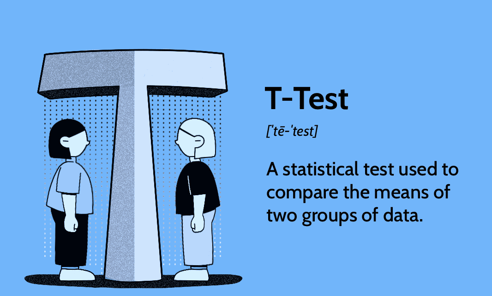

The *t-test* is one of the most commonly used methods to compare means between two groups. In SPSS, you can perform both independent samples t-tests and paired samples t-tests using the GUI.

This guide provides step-by-step instructions for performing both types of t-tests.

<figure markdown="span">
  { width="600" }
  <figcaption>Credit: Investopedia</figcaption>
</figure>

<!-- more -->

## Comparing Two Groups in SPSS: t-Tests

Use t-tests when you want to test whether the **means of two groups differ significantly**.

---

### 1. Independent Samples t-Test

Use this when comparing **two different groups**, e.g., treatment A vs. treatment B.

**Example:**  
Is the systolic blood pressure different between patients treated with Drug A and those treated with Drug B?

**Procedure:**
- Menu: `Analyze` → `Compare Means` → `Independent-Samples T Test`
- Move your **dependent variable** (e.g., blood pressure) into *Test Variable(s)*
- Move your **group variable** (e.g., therapy group) into *Grouping Variable*
- Click `Define Groups` → Specify the two values (e.g., 1 = A, 2 = B)
- Click `OK`

**Output includes:**
- Group means and standard deviations
- Levene’s Test for Equality of Variances
- t-statistic, degrees of freedom, and p-value

**Interpretation Tip:**
- Use **equal variances not assumed** if Levene’s test is significant (*p < 0.05*)
- Check if the p-value for the t-test is below 0.05 to conclude significance

---

### 2. Paired Samples t-Test

Use this when comparing **two measurements from the same subjects**, e.g., before and after treatment.

**Example:**  
Is there a change in quality-of-life score before vs. after an intervention?

**Procedure:**
- Menu: `Analyze` → `Compare Means` → `Paired-Samples T Test`
- Select two related variables (e.g., `QoL_Pre` and `QoL_Post`)
- Click `OK`

**Output includes:**
- Mean difference between time points
- t-statistic, degrees of freedom, and p-value

**Interpretation Tip:**
- A **significant p-value (< 0.05)** means the variable has changed over time

---

### 3. Assumptions and Alternatives

**Assumptions:**
- Continuous dependent variable (interval or ratio scale)
- Approx. normal distribution (especially for small samples)
- Independent t-test: groups must be independent
- Paired t-test: measurements must come from the same individuals

**If assumptions not met:**
- Use **Mann-Whitney U test** (for independent samples)
- Use **Wilcoxon signed-rank test** (for paired samples)

---

### 4. Reporting Results

**Example (independent t-test):**

> The mean systolic blood pressure was significantly higher in group A (M = 130.5, SD = 12.3) compared to group B (M = 124.8, SD = 11.7), *t*(100) = 2.45, *p* = 0.016.

**Example (paired t-test):**

> Quality-of-life scores increased significantly after treatment (Pre: M = 55.2, SD = 8.1; Post: M = 62.4, SD = 7.5), *t*(49) = −4.68, *p* < 0.001.

---
